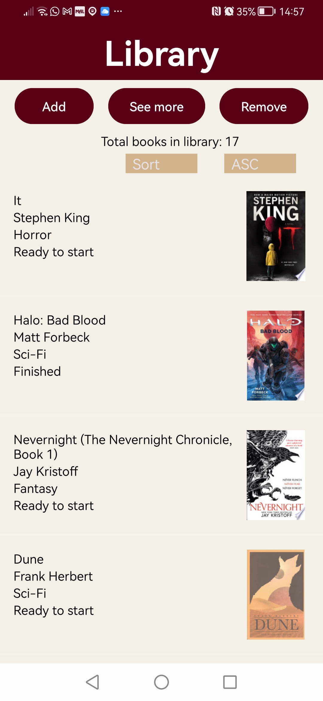
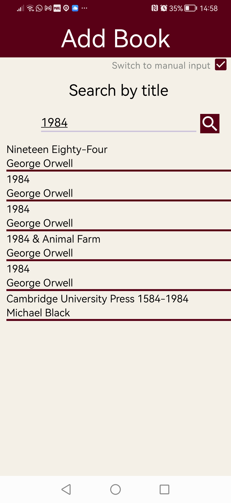
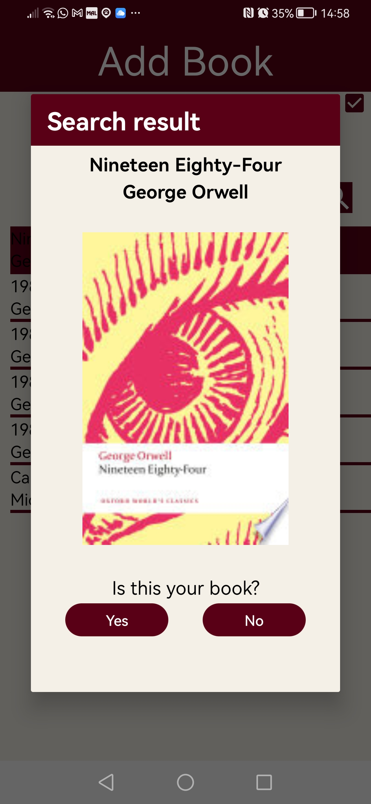
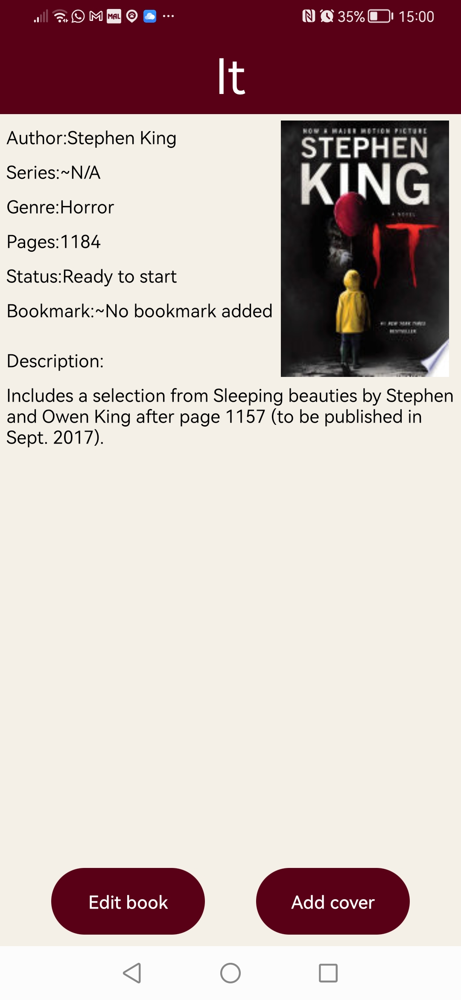
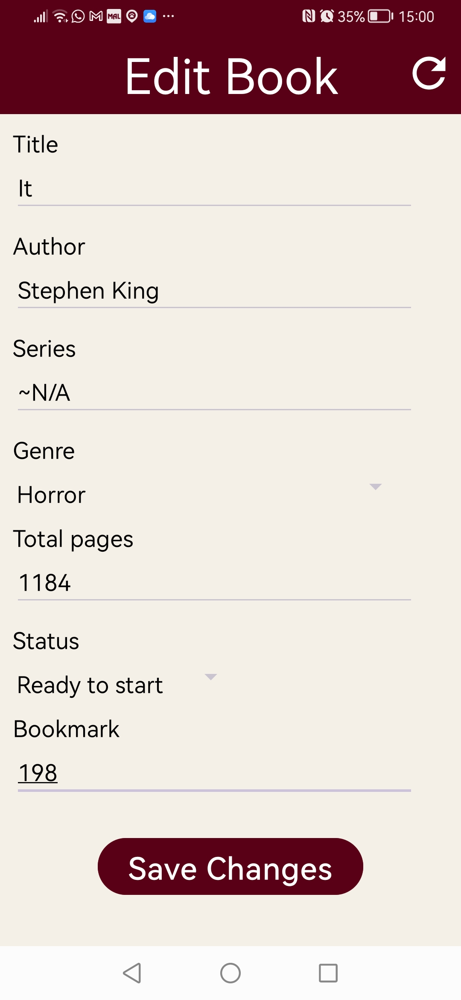

# Library

## A book recording app for personal use. Designed for Android smartphone.

### Purpose

This app is design to act as a digital library, where users can store their personal collection of books and make note of what books they wish to purchase.

### Features

This app is a personal experience, so users will be able to customise their username, profile icon and interace color scheme (in development). The app enable users to log their books to keep track of what books they have, how many, the bookmark for a book they are currently reading, etc. There is also a wishlist page for users to keep track of what books they want to buy next and how much those books costs (via the GoogleBooks listings).

### 1. Home

(Home page in development)

### 2. Library

### 2.1 Main page

The Library tab will take users to their collection of books. Button prompts at the top of the page will allow users to add a new book to their collects, see more information about their book or remove a book from their collect. Once book a book has been added, the users collection will be displayed as a list, which will display information such as: the title, author, cover, genre, etc.

All book data is stored in a SQLite database which is created and stored on the users device.

### 2.2 Add book

In the add book page users will be able to go input a new book to their Library. Users are required to complete fields like: the title, author and genre, however not all fields are required. The user may also record their progress of a book with an optional bookmark field.

")

Users have the option to complete their inputs manually or search for their book to auto-complete certain fields via the Google Books api, this option also automatically provides a cover for the book. Once a book has been searched for a list will be returned where users can selected the book they are searching for.

Once a book is selected the title, author and cover will be displayed for the user. The user can then confirm their selection.

Once the book selection has been confirmed, users will be returned to the input field where they can fill in the rest of the user related information.

")

")

### 2.3 More details

In the more details page, users can see information that is not displayed in the Library page. From here users can select to make changes the book's information or add a cover image (up coming feature) if one has not already been provided.

### 2.4 Edit book

The edit page works the same as the add book page. Here users can correct any errors, change the status of the book or add/change/remove their bookmark.

")